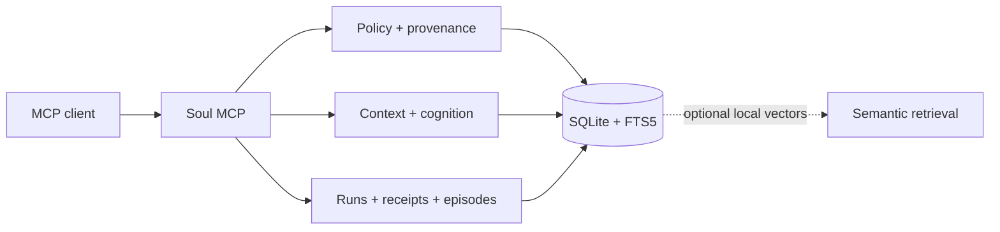

# Soul MCP

**Memory with provenance. Work with receipts. One local file you own.**

[](https://www.npmjs.com/package/soul-mcp)
[](https://www.npmjs.com/package/soul-mcp)
[](https://github.com/christian140903-sudo/soul-mcp/actions/workflows/ci.yml)
[](package.json)
[](LICENSE)

Soul is a local-first persistent memory and auditable runtime for Claude Code,
Claude Desktop, Cursor, Windsurf and any MCP client that can launch a stdio
server. It remembers facts with provenance, shows conflicts instead of silently
choosing a side, compiles relevant context, and records consequential work as
runs, receipts and outcome-linked episodes.

No cloud. No account. No telemetry. One SQLite database at
`~/.soul/memories.db`.

Current release: **4.0.1** · 23 MCP tools · 8 resources · 3 prompts · 350+
automated tests.

## Install in three minutes

```bash
# Optional but useful: initialize and verify the local store
npx -y soul-mcp init
npx -y soul-mcp doctor

# Claude Code
claude mcp add soul -- npx -y soul-mcp
```

For Claude Desktop, Cursor or Windsurf, add this to the client's MCP config:

```json
{
  "mcpServers": {
    "soul": {
      "command": "npx",
      "args": ["-y", "soul-mcp"]
    }
  }
}
```

Restart the client. Then try:

> Remember that I prefer release notes with a short verification section.

Open a new conversation and ask:

> What do you know about how I prefer release notes?

The client decides when to call tools. During setup you can ask it explicitly
to use `soul_remember`, `soul_recall` or `soul_context`.

See the [complete quick start](docs/QUICKSTART.md) for troubleshooting and the
optional local semantic layer.

## Why another memory server?

A list of remembered strings is easy. Trustworthy continuity is harder.

| Failure mode | Soul's behavior |
|---|---|
| A model invents where a fact came from | Every memory carries source type, reference, confidence and status |
| New text contradicts old text | Both sides become disputed; neither is silently crowned true |
| A correction erases history | Corrections supersede and link to the previous claim |
| A secret is accidentally stored | The capture pipeline rejects it and records only a redacted event |
| Prompt-like content enters memory | It is quarantined and excluded from recall |
| Context grows without a budget | `soul_context` compiles a reasoned, token-budgeted capsule |
| An AI claims it completed work | The result is booked as `self_attested`, never magically verified |
| A task disappears between sessions | `soul_run` creates a durable run, receipt and episode together |

Soul is built around one rule: **the model may help interpret evidence, but it
does not acquire user authority by implication.**

## What v4 adds

### Durable runs

`soul_run` turns a free-text task into a `TaskContract@1` and creates the run,
pending receipt and PENDING episode synchronously in one transaction. The
current MCP client performs the work; Soul keeps the books.

`soul_feedback` closes the loop with the observed outcome. An `evidence_ref`
can point to a test command, diff or artifact, but the receipt remains
`self_attested`. Soul 4 never issues `deterministic_verified`; that would
require a validated verifier result, which this release does not produce.

### Outcome-linked episodes

Episodes record the causal chain from recommendation through execution to the
outcome, with separate clocks for when something happened and when Soul learned
about it. Missing outcomes remain missing — they are not imputed as failures or
successes.

### Guarded skill registry

Skills are declarative data, never executable code. Every skill starts in
shadow and moves through guarded lifecycle states:

`shadow → canary → promoted → deprecated → revoked`

Promotion requires an evidence reference. Signed packs use explicit key
pinning; tampering, replay and downgrade attempts fail closed. A context capsule
exposes at most three task-matched promoted skills. Start with the
[example skill](examples/minimal-fix-with-regression-test.skill.json).

### Preregistered evaluation

The repository contains a hashed evaluation protocol, deterministic statistics
and 20 hermetic code tasks with counterfactual verifiers. The pipeline has been
tested mechanically. **No model benchmark results exist yet.** Infrastructure
is not evidence that a model became better.

## The version story

- **v1 remembers:** SQLite/FTS5 persistence. It also shipped with a binary
  entry-point bug and no tests.
- **v2 can be trusted:** provenance, event ledger, conflict handling,
  constitution, context receipts and safe migrations.
- **v3 thinks with the model:** workbench assignments, deliberation,
  prediction calibration and optional local semantic retrieval.
- **v4 makes work durable:** task contracts, runs, receipts, episodes, guarded
  skills and a preregistered evaluation path.

The old failure is part of the story because the current packaging regression
test exists specifically to keep it from returning.

## Tool surface

| Area | Tools |
|---|---|
| Memory | `soul_remember`, `soul_recall`, `soul_confirm`, `soul_correct`, `soul_forget`, `soul_mark_useful` |
| Context | `soul_context`, `soul_feedback`, `soul_reflect` |
| Thinking | `soul_workbench`, `soul_resolve`, `soul_deliberate`, `soul_commit_deliberation`, `soul_predict` |
| Identity and goals | `soul_identity`, `soul_about_me`, `soul_goal` |
| Audit | `soul_timeline`, `soul_status`, `soul_review_queue` |
| Portability | `soul_export`, `soul_import` |
| Durable work | `soul_run` |

The 22 v3 tool contracts remain compatible. v4 adds `soul_run` and extends
`soul_context` and `soul_feedback` additively.

## CLI

```bash
soul-mcp init
soul-mcp status
soul-mcp doctor
soul-mcp backup
soul-mcp restore <backup-file>
soul-mcp export [file]
soul-mcp import <passport>
soul-mcp semantic on

soul-mcp skill list
soul-mcp skill register <manifest.json>
soul-mcp skill transition <name> <state>
soul-mcp skill promote <name> --evidence <ref>
soul-mcp skill revoke <name>
soul-mcp skill pin <pack.json>
soul-mcp skill import <pack.json>
```

## Architecture and trust boundary

Soul is one process with a module-per-concern kernel behind a single MCP
server. Every mutation crosses policy, provenance and ledger boundaries before
it reaches SQLite.



Read the [architecture guide](docs/ARCHITECTURE.md), the
[threat model](docs/THREAT-MODEL.md) and the canonical
[API matrix](docs/API-MATRIX.md).

## Security and data ownership

- The database, constitution and backups live under `~/.soul`.
- Existing databases migrate only after a verified backup.
- Passport imports are checksummed, size-limited and screened through the same
  capture boundary as live writes.
- The server makes no background network calls.
- `semantic on` is explicit because it installs an additional dependency and
  downloads a local embedding model.
- A compromised host OS or malicious process that already has access to the
  user's account is outside Soul's sandbox boundary.

Please report vulnerabilities through the process in [SECURITY.md](SECURITY.md)
and never attach a real database or passport to a public issue.

## Honest limits

- **No worker:** context mode only. Soul does not spawn agents, models or shell
  commands.
- **No model benchmark results:** the protocol and task harness exist; the
  preregistered model measurements have not run.
- No competence maps or routing recommendations. Episodes first; causal claims
  later, if the evidence supports them.
- Skill promotion checks evidence structure, not whether the evidence is true.
- The current passport writer remains format 2.0.0; the sectioned v3 envelope
  is read fail-closed but is not written yet.

## Evidence, not adjectives

The 4.0 release baseline passed 355 tests, including MCP golden transcripts,
database migrations, import and secret-handling regressions, retry races,
signed-pack failures and five SIGKILL chaos cases. CI now runs the full suite on
Node 18, 20 and 22. `npm pack --dry-run` checks the public package contents.

Run it yourself:

```bash
npm ci
npm test
```

## Project

- [Changelog](CHANGELOG.md)
- [Roadmap](ROADMAP.md)
- [Quick start](docs/QUICKSTART.md)
- [Architecture](docs/ARCHITECTURE.md)
- [Threat model](docs/THREAT-MODEL.md)
- [Contributing](CONTRIBUTING.md)

Soul is an independent open-source project by **Christian Bucher**, developed
with **Miguel**, his AI systems co-builder, under human review. That
collaboration model is stated plainly: the value is in the architecture,
selection, testing, correction and shipped system — not a claim that every
line was typed without AI.

If Soul earns a place in your workflow, star the repository, share the MCP
client you use, and open an issue with the first trust boundary that still gets
in your way.

MIT licensed.
