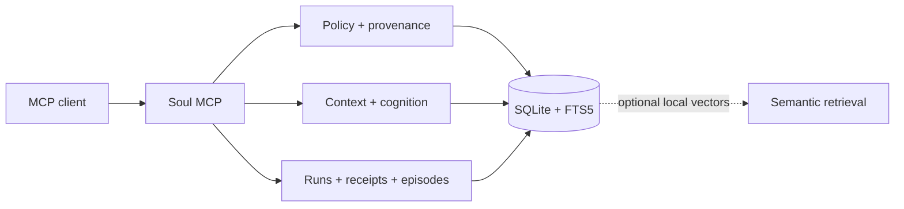

# Soul MCP

**Persistent memory for MCP clients that records where every memory came from, keeps contradictions visible instead of overwriting them, and quarantines stored text that looks like an instruction.**

[](https://www.npmjs.com/package/soul-mcp)
[](https://github.com/christian140903-sudo/soul-mcp/actions/workflows/ci.yml)
[](package.json)
[](LICENSE)

Soul is a local-first memory server and auditable runtime for Claude Code, Claude Desktop, Cursor, Windsurf and any MCP client that can launch a stdio server. It is for people who want an assistant's long-term memory to be inspectable: every memory carries source type, confidence and status, and work is booked as durable runs with receipts and outcome-linked episodes. Soul stores, screens and compiles context; the client decides what to do with it.

**No cloud. No account. No telemetry.** One SQLite database you own: the database (`~/.soul/memories.db`), constitution and backups live under `~/.soul`.


## Try it in two minutes

```bash
# Claude Code
claude mcp add soul -- npx -y soul-mcp

# Optional: create and check the local store first
npx -y soul-mcp init
npx -y soul-mcp doctor
```

For Claude Desktop, Cursor or Windsurf, add this to the client's MCP config:

```json
{
  "mcpServers": {
    "soul": {
      "command": "npx",
      "args": ["-y", "soul-mcp"]
    }
  }
}
```

Restart the client. Then try:

> Remember that I prefer release notes with a short verification section.

Open a new conversation and ask:

> What do you know about how I prefer release notes?

The client decides when to call tools. During setup you can ask it explicitly
to use `soul_remember`, `soul_recall` or `soul_context`.

Checked on 2026-10-08 against the published 4.0.2 in a clean environment
(Node 22, empty npm cache): `doctor` passed all checks, `claude mcp list`
reported the server as connected, and a scripted MCP client stored the
preference above and recalled it word for word. Claude Desktop, Cursor and
Windsurf were not re-tested on that date.

See the [complete quick start](docs/QUICKSTART.md) for troubleshooting and the
optional local semantic layer.

## Why it exists

A list of remembered strings is easy. Trustworthy continuity is harder. A
memory that cannot say where a fact came from, that overwrites the old version
when new text disagrees, or that replays a stored "ignore previous
instructions" in a later session is worse than no memory at all.

| Failure mode | Soul's behavior |
|---|---|
| A model invents where a fact came from | Every memory carries source type, reference, confidence and status |
| New text contradicts old text | Both sides become disputed; neither is silently crowned true |
| A correction erases history | Corrections supersede and link to the previous claim |
| A secret is accidentally stored | The capture pipeline rejects it and records only a redacted event |
| Prompt-like content enters memory | It is quarantined and excluded from recall |
| Context grows without a budget | `soul_context` compiles a reasoned, token-budgeted capsule |
| An AI claims it completed work | The result is booked as `self_attested`, never magically verified |
| A task disappears between sessions | `soul_run` creates a durable run, receipt and episode together |

Soul is built around one rule: **the model may help interpret evidence, but it
does not acquire user authority by implication.**

**Compared with the reference memory server.**
[`@modelcontextprotocol/server-memory`](https://www.npmjs.com/package/@modelcontextprotocol/server-memory)
keeps a knowledge graph of entities, relations and observations in one JSONL
file, with nine tools. It is smaller and easier to read, and it is enough if
you only need a fact graph. It has no fields for source or confidence and does
not screen stored text for secrets or instructions (checked against its README
and code, version 2026.8.31, on 2026-10-08). Soul adds those, at the cost of a
larger surface (23 tools, 8 resources, 3 prompts) and a native SQLite
dependency.

## Verify it yourself

```bash
git clone https://github.com/christian140903-sudo/soul-mcp.git
cd soul-mcp
npm ci
npm test
```

Expected output: `tests 374 pass 374 fail 0` (last verified 2026-10-08, Node 22,
fresh clone; clone, install and tests took 45 seconds on that machine).

**Smoke test the packed release** (installs the real npm tarball and verifies MCP stdio handshake):

```bash
npm run smoke:pack
```

Expected output: `Packed release verified: soul-mcp@4.0.2, 23 MCP tools.`

**What the tests cover:** MCP golden transcripts, database migrations, import
and secret-handling regressions, retry races, signed-pack failures and five
SIGKILL chaos cases. CI runs the full suite on Node 20, 22 and 24; on Node 24 it
also packs the release, installs the tarball and completes an MCP handshake.

**What they do not cover:** whether a model gives better answers with Soul
attached (see [Preregistered evaluation](#preregistered-evaluation)), injection
styles the detection patterns do not know, and behavior inside specific
clients beyond the stdio handshake.

## What it does not do

- **No worker.** Soul does not spawn agents, models or shell commands. It compiles context; execution is the client's choice.
- **No cloud.** The database never leaves `~/.soul`. Imports are checksummed and screened; the server makes no background network calls.
- **No demonstrated quality gain.** The one model run so far found none for Soul without skills; the skill effect is unmeasured (see [Preregistered evaluation](#preregistered-evaluation)).
- **No guarantee against injection.** Detection is pattern-based: text that does not look like an instruction is stored normally, and a new injection style can get through. Quarantine is one layer, not proof (risk R1 in the [threat model](docs/THREAT-MODEL.md), written in German).
- **No verified receipts.** Outcomes are booked as `self_attested`; Soul 4 never issues `deterministic_verified`.
- **No competence routing.** Episodes record outcomes; causal claims require evidence links.
- **No hash-chained ledger.** The event log is append-only by convention. A compromised host OS already inside the user's account is outside Soul's sandbox boundary.
- **Conflict detection is Jaccard-based,** not cryptographic. Disputed pairs surface; resolution requires user review.
- **Semantic mode downloads ~380 MB locally** when enabled (`soul-mcp semantic on`). This is opt-in because it adds a local embedding dependency.

## What v4 adds

### Durable runs

`soul_run` turns a free-text task into a `TaskContract@1` and creates the run,
pending receipt and PENDING episode synchronously in one transaction. The
current MCP client performs the work; Soul keeps the books.

`soul_feedback` closes the loop with the observed outcome. An `evidence_ref`
can point to a test command, diff or artifact, but the receipt remains
`self_attested`. Soul 4 never issues `deterministic_verified`; that would
require a validated verifier result, which this release does not produce.

### Outcome-linked episodes

Episodes record the causal chain from recommendation through execution to the
outcome, with separate clocks for when something happened and when Soul learned
about it. Missing outcomes remain missing — they are not imputed as failures or
successes.

### Guarded skill registry

Skills are declarative data, never executable code. Every skill starts in
shadow and moves through guarded lifecycle states:

`shadow → canary → promoted → deprecated → revoked`

Promotion requires an evidence reference. Signed packs use explicit key
pinning; tampering, replay and downgrade attempts fail closed. A context capsule
exposes at most three task-matched promoted skills. Start with the
[example skill](examples/minimal-fix-with-regression-test.skill.json).

### Preregistered evaluation

The repository contains a hashed evaluation protocol, deterministic statistics
and 20 hermetic code tasks with counterfactual verifiers (`eval/`). The
verifier pipeline has been tested mechanically: 30 deterministic runs, see
[eval/pilot/PILOT-REPORT.md](eval/pilot/PILOT-REPORT.md).

One descriptive model run exists (2026-08-14, recorded in my evidence
inventory): the same 20 tasks, one run each, claude-sonnet-5 on its own versus
claude-sonnet-5 with soul-mcp 4.0.1 attached but no skills. Both solved 18 of
20. The Soul arm cost about 2.7× as much per run and took about 2.3× as long,
because of three extra MCP round trips. So plain runtime attachment showed no
quality gain on this small set, and the skill effect is unmeasured. This run
was not one of the preregistered gates, and its raw artifacts are not yet
published, so it cannot be checked from outside yet. Infrastructure is not
evidence that a model became better.

## The version story

- **v1 remembers:** SQLite/FTS5 persistence. It also shipped with a binary
  entry-point bug and no tests.
- **v2 can be trusted:** provenance, event ledger, conflict handling,
  constitution, context receipts and safe migrations.
- **v3 thinks with the model:** workbench assignments, deliberation,
  prediction calibration and optional local semantic retrieval.
- **v4 makes work durable:** task contracts, runs, receipts, episodes, guarded
  skills and a preregistered evaluation path.

The old failure is part of the story because the current packaging regression
test exists specifically to keep it from returning.

## 23 MCP Tools

The 22 v3 tool contracts remain compatible. v4 adds `soul_run` and extends
`soul_context` and `soul_feedback` additively.

### Core (memory, provenance, runs)

| Area | Tools |
|---|---|
| **Memory** | `soul_remember`, `soul_recall`, `soul_confirm`, `soul_correct`, `soul_forget`, `soul_mark_useful` |
| **Context, identity & goals** | `soul_context`, `soul_identity`, `soul_about_me`, `soul_goal` |
| **Provenance & audit** | `soul_timeline`, `soul_status`, `soul_review_queue`, `soul_export`, `soul_import` |
| **Durable runs** | `soul_run`, `soul_feedback`, `soul_reflect` |

### Workbench (optional)

Added in v3: deterministic think-assignments (unresolved conflicts, merge
candidates, old low-confidence inferences), deliberation scaffolds and
prediction calibration. The core tools work without calling these. When the
model profile in the constitution allows it and the token budget has room,
`soul_context` attaches open assignments to its capsule.

| Area | Tools |
|---|---|
| **Assignments** | `soul_workbench`, `soul_resolve` |
| **Deliberation & calibration** | `soul_deliberate`, `soul_commit_deliberation`, `soul_predict` |

## CLI

```bash
soul-mcp init
soul-mcp status
soul-mcp doctor
soul-mcp backup
soul-mcp restore <backup-file>
soul-mcp export [file]
soul-mcp import <passport>
soul-mcp semantic on

soul-mcp skill list
soul-mcp skill register <manifest.json>
soul-mcp skill transition <name> <state>
soul-mcp skill promote <name> --evidence <ref>
soul-mcp skill revoke <name>
soul-mcp skill pin <pack.json>
soul-mcp skill import <pack.json>
```

## Architecture and trust boundary

Soul is one process with a module-per-concern kernel behind a single MCP
server. Every mutation crosses policy, provenance and ledger boundaries before
it reaches SQLite.


```mermaid
flowchart LR
  C["MCP client"] --> S["Soul MCP"]
  S --> P["Policy + provenance"]
  P --> DB[("SQLite + FTS5")]
  S --> X["Context + cognition"]
  X --> DB
  S --> R["Runs + receipts + episodes"]
  R --> DB
  DB -. "optional local vectors" .-> V["Semantic retrieval"]
```

Read the [architecture guide](docs/ARCHITECTURE.md), the
[threat model](docs/THREAT-MODEL.md) and the canonical
[API matrix](docs/API-MATRIX.md).

## Security and data ownership

- The database, constitution and backups live under `~/.soul`.
- Existing databases migrate only after a verified backup.
- Passport imports are checksummed, size-limited and screened through the same
  capture boundary as live writes.
- The server makes no background network calls.
- `semantic on` is explicit because it installs an additional dependency and
  downloads a local embedding model.
- A compromised host OS or malicious process that already has access to the
  user's account is outside Soul's sandbox boundary.

Please report vulnerabilities through the process in [SECURITY.md](SECURITY.md)
and never attach a real database or passport to a public issue.

## How this was built

Most of the code was written by AI coding agents (mainly Claude Code) under my
direction. I wrote the specification, set the constraints, decided what to
test, reviewed the result and rejected what did not hold. Release decisions
and every claim in this README are mine.

## Status

Maintained · single maintainer · no external users documented yet · last npm
release 2026-08-14 · last verified 2026-10-08.

Current release: **4.0.2** · 23 MCP tools · 8 resources · 3 prompts · Tests in this repository: 374/374 with statement coverage 89.61%, branch coverage 79.01%, function coverage 91.24%, line coverage 89.61% (measured 2026-10-08; the 4.0.2 release shipped with 373 tests).

The repository is ahead of npm: the dependency and security updates listed
under *Unreleased* in the [changelog](CHANGELOG.md) are not published yet.
What comes next is ordered by evidence in the [roadmap](ROADMAP.md); those are
candidates, not release promises.

Issues are welcome — especially the first trust boundary that still gets in
your way, and which MCP client you use.

## Project resources

- [Changelog](CHANGELOG.md)
- [Roadmap](ROADMAP.md)
- [Quick start](docs/QUICKSTART.md)
- [5-minute demo](docs/DEMO.md)
- [Architecture](docs/ARCHITECTURE.md)
- [Threat model](docs/THREAT-MODEL.md)
- [API matrix](docs/API-MATRIX.md)
- [Contributing](CONTRIBUTING.md)

## License

MIT © [Christian Bucher](https://github.com/christian140903-sudo)
