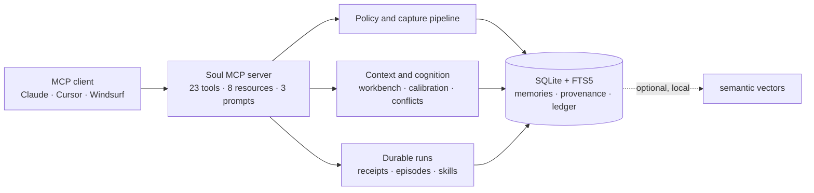

# Architecture

Soul is one MCP stdio process over one user-owned SQLite database. It does not
proxy a model and does not run a cloud service.

## Write path

Every memory mutation crosses the same storage boundary:

1. classify provenance and sensitivity;
2. reject secrets and quarantine instruction-like content;
3. detect exact duplicates and possible conflicts;
4. write the state change and append its ledger event;
5. update retrieval surfaces without losing correction history.

Tools do not write directly around this path. Imports use it too.

## Read path

`soul_context` compiles a token-budgeted capsule from identity, goals,
memories, conflicts and open workbench assignments. Every included memory
carries source, confidence and a reason for inclusion. Private-sensitivity
content is excluded by the constitution.

FTS5 retrieval is always available. Semantic retrieval is optional and local;
it adds candidates, then Soul resolves their current status through SQLite
before returning them.

## Durable run path

`soul_run` creates a task contract, run, pending receipt and PENDING episode
in one transaction. The MCP client executes the task in the current
conversation. `soul_feedback` closes the receipt and records the observed
outcome. A self-reported result stays `self_attested`, even when it carries an
evidence reference.

## Upgrade boundary

The current schema is v12. Migrations are additive and make a verified SQLite
backup before changing an existing store. Public behavior is pinned by MCP
golden transcripts and contract tests.
